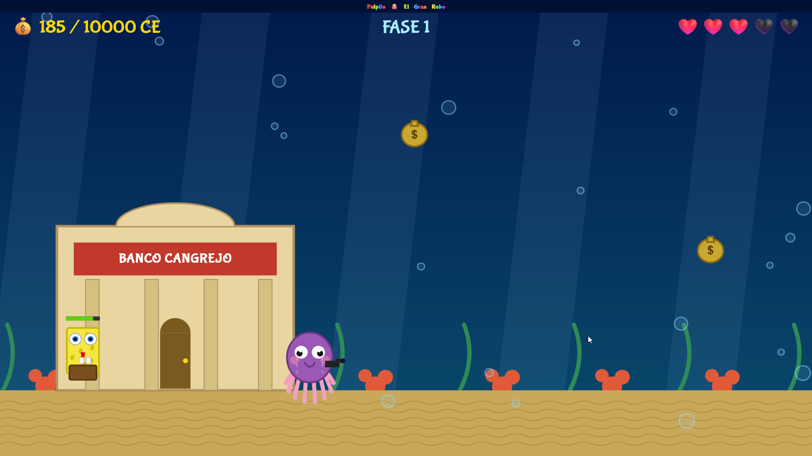

# Pulpito 🐙

Juego educativo de un pulpo de peluche.

## 🎮 Introducción

**Pulpito: El Gran Robo del Fondo del Mar** es un videojuego 2D creado con **JavaScript (ES2022)** y **HTML5 Canvas**.  
Acompañas a Pulpito en una aventura submarina por fases, esquivando enemigos, recogiendo Cangre Euros y superando retos hasta la victoria final.

## 🧠 Enfoque educativo

Este juego está diseñado con fines educativos y lúdicos para reforzar habilidades como:

- **Coordinación óculo-manual** (movimiento y disparo).
- **Atención sostenida** y seguimiento de objetivos en pantalla.
- **Reflejos y tiempo de reacción** ante enemigos y proyectiles.
- **Toma de decisiones rápida** en situaciones dinámicas.
- **Perseverancia y gestión del error** al avanzar por fases.
- **Motivación por objetivos** mediante progreso, vidas y recompensas.

Su estilo visual colorido y controles simples lo hacen ideal para aprender jugando.

## 🧡 Dedicatoria

Con mucho cariño, este juego está dedicado a mis sobrinos:  
**Dani, Luci, Rubén y Jorge**.

## 📸 Screenshot

## ▶️ Jugar al juego

https://bartbender.github.io/Pulpito/
